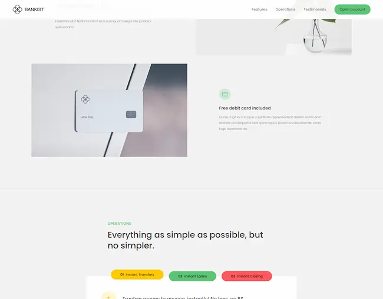

<div align="center">

<h2>
    <em>Bankist</em>
</h2>
<p>
Una página web de ejemplo que muestra una interfaz de usuario moderna para un banco ficticio. Este proyecto incluye características como navegación, secciones de contenido, testimonios de usuarios, y un formulario modal para abrir una cuenta bancaria.
</p>

<p> Creado siguiendo el cursos de <a href="https://samuhlo-training.github.io/DOM-Bankist/">Jonas Schmedtmann</a>
</p>

<strong><a href="https://curriculum-astro-curse.vercel.app/">LINK</a></strong>

</div>

<div align="center">
    <a href="#funcionalidades">
        Funcionalidades
    </a>
    <span>&nbsp;✦&nbsp;</span>
    <a href="#ejecutar">
        Ejecutar proyecto
    </a>
   
</div>

<p></p>

<div align="center">


</img>

</div>

## Funcionalidades

- Navegacion : La navegación incluye enlaces a diferentes secciones de la página y un menú hamburguesa para pantallas pequeñas.

- Modal : Un formulario modal que permite a los usuarios abrir una cuenta bancaria.

- Desplazamiento Suave : El botón "Learn more" y los enlaces de navegación permiten un desplazamiento suave a las diferentes secciones de la página.
- Componentes con Pestañas : La sección de "Operations" incluye un componente con pestañas que permite a los usuarios cambiar entre diferentes contenidos.

- Animaciones :
  - Desvanecimiento del Menú: El menú de navegación se desvanece al pasar el ratón sobre los enlaces.
  - Navegación Pegajosa: La barra de navegación se vuelve pegajosa al desplazarse hacia abajo.
  - Revelar Secciones: Las secciones se revelan al desplazarse hacia ellas.
  - Carga Perezosa de Imágenes: Las imágenes se cargan perezosamente para mejorar el rendimiento.
  - Slider: Un slider que muestra testimonios de usuarios.

## Ejecutar el Proyecto

### 1. Clona el repositorio

```bash
git clone https://github.com/samuhlo-training/DOM-bankist.git
```

### 2. Navega al directoriio del proyecto

```bash
cd DOM-bankist
```

### 3. Abre index.html en tu navegador
